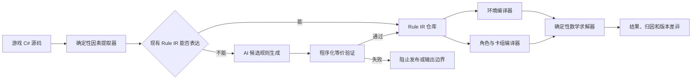

# 《杀戮尖塔 2》角色强度确定性量化系统设计

## 1. 文档目的

本文定义一套不依赖玩家对局数据、不使用统计胜率、不通过 AI 直接评分的角色强度计算系统。

系统从游戏源码提取角色、卡牌、遗物、怪物、遭遇、地图与概率规则，将它们编译成统一数学中间表示（Rule IR），再通过组合数学、状态机、动态规划、优化求解和区间算术计算结果。

AI 只允许出现在程序无法理解全新源码语义的地方，用于生成候选 Rule IR 或适配器。AI 输出必须通过确定性程序验证；AI 不参与数值权重、卡牌评级、环境评级或最终求解。

## 2. 目标与非目标

### 2.1 目标

1. 使用同一环境模型评价所有角色。
2. 角色差异只来自角色自身定义：初始状态、固有机制、初始遗物、初始卡组和成长池。
3. 所有结果可以追溯到源码字段、行为分支和公式。
4. 正确表达卡牌组合的非加性价值，包括 `1 + 1 > 2`、负协同和高阶协同。
5. 新内容由程序自动检测和增量重算。
6. 无法精确表达的机制必须输出上下界或阻止发布，不能静默忽略。
7. 固定环境结果与当前版本环境结果分开保存，保证跨版本可比性。

### 2.2 非目标

1. 不拟合玩家胜率。
2. 不使用玩家选牌率、卡牌胜率或社区排名。
3. 不让 AI 直接判断某张卡强弱。
4. 不把单卡分数简单相加作为卡组强度。
5. 不宣称对任意 C# 程序都能自动完成无误的数学语义推导。

## 3. 核心定义

版本环境记为：

\[
E_v=\{\text{地图、遭遇、怪物、奖励、商店、事件及其代码概率}\}
\]

角色记为：

\[
C_c=(H_c,M_c,R_c,D_c,P_c,L_c,Q_c)
\]

其中：

- \(H_c\)：初始生命等基础资源；
- \(M_c\)：角色固有机制，如球位、Osty、星能；
- \(R_c\)：初始遗物；
- \(D_c\)：初始卡组；
- \(P_c\)：专属卡池；
- \(L_c\)：专属遗物池；
- \(Q_c\)：专属药水池。

角色在版本环境下的强度定义为：

\[
S_{c,v}=F(E_v,C_c)
\]

这里的 \(F\) 是确定性数学求解器，不是统计模型。

系统同时保存环境无关的能力画像：

\[
Intrinsic_c=G(C_c)
\]

以及当前环境适配结果：

\[
Fit_{c,v}=F(E_v,C_c)
\]

这样可以区分“角色规则发生变化”和“环境变得更适合或更不适合该角色”。

## 4. 已确认的源码入口

目标源码位于：

```text
D:\work\godot\Slay the Spire 2
```

主要数据入口：

```text
src/Core/Models/CharacterModel.cs
src/Core/Models/Characters/*.cs
src/Core/Models/CardModel.cs
src/Core/Models/CardPools/*.cs
src/Core/Models/RelicModel.cs
src/Core/Models/RelicPools/*.cs
src/Core/Models/PotionPools/*.cs
src/Core/Models/MonsterModel.cs
src/Core/Models/Monsters/*.cs
src/Core/Models/EncounterModel.cs
src/Core/Models/Encounters/*.cs
src/Core/Models/ActModel.cs
src/Core/Map/StandardActMap.cs
src/Core/Odds/CardRarityOdds.cs
src/Core/Factories/CardFactory.cs
src/Core/Runs/RunRngSet.cs
```

`CharacterModel` 已统一暴露：

```text
StartingHp
StartingGold
MaxEnergy
BaseOrbSlotCount
CardPool
RelicPool
PotionPool
StartingDeck
StartingRelics
StartingPotions
```

## 5. 总体架构



建议实现目录：

```text
StrengthModel/
├── Extractors/
│   ├── CharacterExtractor.cs
│   ├── CardExtractor.cs
│   ├── RelicExtractor.cs
│   ├── MonsterExtractor.cs
│   ├── EncounterExtractor.cs
│   └── ProbabilityExtractor.cs
├── Rules/
│   ├── Schema/
│   ├── Operators/
│   ├── Generated/
│   └── Manual/
├── AiAssistance/
│   ├── UnsupportedRuleQueue.cs
│   ├── AiRuleTranslator.cs
│   └── AiProposalStore.cs
├── Verification/
│   ├── SchemaVerifier.cs
│   ├── DataFlowVerifier.cs
│   ├── TransitionVerifier.cs
│   └── InvariantVerifier.cs
├── Environment/
│   ├── EnvironmentCompiler.cs
│   └── EncounterDemandSolver.cs
├── Decks/
│   ├── DeckValueSolver.cs
│   ├── SynergySolver.cs
│   └── CardPoolSolver.cs
├── Solvers/
│   ├── CombatDynamicProgram.cs
│   ├── MacroDynamicProgram.cs
│   └── IntervalSolver.cs
└── Reports/
    ├── CoverageReport.cs
    ├── StrengthReport.cs
    └── ChangeReport.cs
```

## 6. 因素获取流程

### 6.1 固定计算配置

任何计算开始前必须锁定：

```json
{
  "game_build": "source-hash",
  "mode": "singleplayer",
  "ascension": 10,
  "unlocks": "all",
  "acts": "standard",
  "player_count": 1,
  "combat_horizon": 12,
  "probability_epsilon": 0.000001
}
```

环境、角色、IR Schema、求解器和配置都参与结果哈希。

### 6.2 第一层：运行时反射

只初始化 `ModelDb`，不启动实际对局。读取规范模型对象中的声明式数据：

- 角色初始参数；
- 卡牌费用、类型、稀有度、目标、关键词和 DynamicVar；
- 初始卡组和初始遗物；
- 卡池、遗物池和药水池成员；
- 怪物生命区间；
- 遭遇所包含的怪物；
- 章节和遭遇池。

每项因素保存源码位置和提取方式：

```json
{
  "id": "Ironclad.StartingHp",
  "value": 80,
  "source": "src/Core/Models/Characters/Ironclad.cs:30",
  "method": "reflection",
  "exactness": "exact"
}
```

### 6.3 第二层：Roslyn 语义分析

通过 Roslyn 分析方法体和调用图，将常见行为转换为 Rule IR。优先支持：

```text
DamageCmd.Attack
CreatureCmd.Damage
CreatureCmd.GainBlock
CreatureCmd.Heal
CardPileCmd.Draw
CardPileCmd.AddToCombatAndPreview
PowerCmd.Apply<T>
PowerCmd.Remove<T>
OrbCmd.Channel<T>
OrbCmd.EvokeNext
OstyCmd.Summon
PlayerCmd.GainStars
CardCmd.Exhaust
CardCmd.Discard
```

分析器同时记录：

- 读取了哪些状态；
- 修改了哪些状态；
- 执行顺序；
- 条件分支；
- 循环次数或上界；
- 注册和响应的 Hook；
- 调用的其他规则实体。

### 6.4 第三层：显式机制适配器

任意 C# 行为无法保证被通用静态分析完全理解。复杂状态机、动态委托、反射、跨对象 Hook 和规则重写进入适配器队列。

适配器只描述源码行为，不允许写入人为强度分。

### 6.5 第四层：AI 候选转换

只有出现 `unsupported` 时才允许调用 AI。AI 输入只包含：

- 未支持的方法及必要调用链；
- 相关类型；
- 当前可用 Rule IR 操作符；
- IR Schema；
- 数据流读写结果。

AI 只能输出候选 Rule IR、适配器代码和候选测试，不能输出角色或卡牌强度。

AI 结果必须经过：

1. Schema 验证；
2. 源码数据流一致性验证；
3. Hook 和效果顺序验证；
4. 合成状态转换等价验证；
5. 概率、资源和状态不变量验证。

验证失败则阻止发布。

## 7. Rule IR 设计

### 7.1 基础状态

```text
CombatState
├── Player
│   ├── Hp / MaxHp
│   ├── Energy
│   ├── Block
│   ├── Hand / Draw / Discard / Exhaust
│   ├── Powers
│   ├── Relics
│   ├── Potions
│   ├── Orbs
│   ├── Osty
│   └── Stars
├── Enemies
│   ├── Hp / MaxHp
│   ├── Block
│   ├── Powers
│   └── MoveState
└── Turn
```

新资源通过注册新的有界状态变量扩展，不能使用没有上下界和转移规则的自由字段。

### 7.2 基础操作符

```text
Sequence
Parallel
Conditional
Repeat
RandomChoice
ModifyResource
ApplyStatus
RemoveStatus
AddCard
MoveCard
TransformCard
SpawnCreature
RestrictAction
RegisterTrigger
EffectRewrite
ChangeRule
```

每个操作符必须实现：

```csharp
public interface IMathRuleOperator
{
    StateDistribution Apply(
        StateDistribution input,
        EvaluationContext context);

    ValueInterval Bound(
        StateInterval input,
        EvaluationContext context);

    IEnumerable<DependencyId> GetDependencies();

    ValidationResult Validate();
}
```

## 8. 环境模型

### 8.1 怪物状态机

单个怪物表示为：

\[
\mathcal E_e=(Q_e,P_e,O_e)
\]

- \(Q_e\)：行为状态；
- \(P_e\)：状态转移矩阵；
- \(O_e\)：每个状态的伤害、格挡、强化、减益、召唤等效果。

第 \(t\) 回合状态分布：

\[
p_{t+1}=p_tP_e
\]

伤害分布和其他效果分布从状态概率直接计算，不运行实际对局。

### 8.2 遭遇模型

每个遭遇保留完整需求，不只保留一个平均分：

\[
R_e=(r_{burst},r_{sustain},r_{block},r_{aoe},r_{scale},r_{draw},r_{status},r_{heal})
\]

维度只用于解释和剪枝；最终价值仍由完整状态转移求解，不通过人工维度权重相加。

### 8.3 环境概率

源码随机操作转换为精确概率：

| 源码操作 | 数学表示 |
|---|---|
| `NextItem(items)` | 离散均匀分布 |
| `NextInt(a,b)` | 整数区间均匀分布 |
| `WeightedNextItem` | 归一化权重 |
| `NextFloat() < p` | 伯努利分布 |
| `Shuffle` | 多重集排列分布 |
| 状态相关稀有度 | 带记忆状态的马尔可夫过程 |

地图中存在选择时，通过最优子节点递推，而不是把所有路径平均：

\[
V(m)=\max_{p\in Children(m)}V(p)
\]

## 9. 角色与初始卡组模型

角色初始状态：

\[
x_c^0=(H_c,M_c,R_c,D_c)
\]

固定卡组的抽牌使用多元超几何分布：

\[
P(n_1,\dots,n_m)=
\frac{\prod_i\binom{N_i}{n_i}}
{\binom{N}{h}}
\]

固定遭遇中的最优价值通过有限回合动态规划计算：

\[
V_t(x)=\max_{a\in A(x)}\sum_{x'}P(x'\mid x,a)V_{t+1}(x')
\]

其中 \(A(x)\) 由费用、目标、状态和 Rule IR 自动生成。

## 10. 卡组强度与 `1 + 1 > 2`

### 10.1 基本原则

卡组价值是集合函数，而不是单卡分数之和：

\[
V(D)\neq\sum_{k\in D}v(k)
\]

主计算必须直接求整副牌的价值：

\[
V(D;E)=\sum_e w_eV_e(D)
\]

力量与多段攻击、弃牌触发与弃牌手段、消耗收益与消耗手段、球位与充能牌等协同，会通过状态转移组合自然进入 \(V_e(D)\)。

协同指标只负责解释“额外价值从哪里产生”，不能再次加到 \(V(D)\) 上，否则会重复计算。

### 10.2 条件边际价值

卡牌 \(i\) 在当前卡组 \(D\) 中的真实边际价值是：

\[
\Delta_iV(D)=V(D\cup\{i\})-V(D)
\]

因此同一张卡在不同卡组中的价值可以不同，甚至改变正负号。

### 10.3 二张卡的协同

卡牌 \(i,j\) 相对于上下文卡组 \(D\) 的二阶协同：

\[
Syn(i,j\mid D)=
V(D\cup\{i,j\})
-V(D\cup\{i\})
-V(D\cup\{j\})
+V(D)
\]

- \(Syn>0\)：正协同，满足 `1 + 1 > 2`；
- \(Syn=0\)：近似独立；
- \(Syn<0\)：负协同，包括费用竞争、抽牌稀释和功能冗余。

这就是价值函数的离散二阶导数。

### 10.4 同名卡的重复收益

卡组是多重集。设牌数向量为 \(n\)，\(e_i\) 表示增加一张卡 \(i\)：

\[
\Delta_{ii}V(n)=
V(n+2e_i)-2V(n+e_i)+V(n)
\]

- \(\Delta_{ii}>0\)：多张会加速成型或相互放大；
- \(\Delta_{ii}<0\)：第二张开始稀释牌组或收益递减。

### 10.5 高阶协同

三张或更多卡可能形成单独两张无法形成的闭环。集合 \(S\) 的纯高阶交互使用 Möbius 反演：

\[
I(S\mid D)=
\sum_{T\subseteq S}
(-1)^{|S|-|T|}V(D\cup T)
\]

三卡交互为：

\[
\begin{aligned}
I(i,j,k\mid D)=&V(D+i+j+k)\\
&-V(D+i+j)-V(D+i+k)-V(D+j+k)\\
&+V(D+i)+V(D+j)+V(D+k)-V(D)
\end{aligned}
\]

这能识别“启动器 + 资源生成 + 收益终端”三件套，而不会把全部价值错误归入某一张单卡。

### 10.6 协同必须乘以可实现性

规则上的协同不等于实际牌组中的有效协同。还要满足：

1. 能在需要的时间抽到；
2. 能量和其他资源足够；
3. 出牌顺序合法；
4. 目标和战斗类型适合；
5. 协同完成前不会被环境需求击穿。

两类卡在大小为 \(h\) 的手牌中共同出现的概率可由容斥直接计算。设牌组大小为 \(N\)，A 类有 \(a\) 张，B 类有 \(b\) 张：

\[
P(A\cap B)=
1-
\frac{\binom{N-a}{h}}{\binom Nh}
-
\frac{\binom{N-b}{h}}{\binom Nh}
+
\frac{\binom{N-a-b}{h}}{\binom Nh}
\]

多回合抽牌、保留、弃牌、检索和洗牌通过牌堆状态动态规划计算，不用独立概率近似。

能量可实现性由合法行动集合直接判断：

\[
Feasible(i,j,x)=
\mathbf 1[Cost_i(x)+Cost_j(T_i(x))\le Resource(x)]
\]

顺序相关时分别计算：

\[
V(T_j(T_i(x)))\quad\text{与}\quad V(T_i(T_j(x)))
\]

不能把它们视为交换律成立。

### 10.7 触发器与乘区

Rule IR 必须保留事件顺序和触发次数。若卡牌 A 提供每次攻击额外收益 \(q\)，卡牌 B 产生 \(m\) 次攻击，则组合值中的交互项包含：

\[
q\times m
\]

但该乘积不需要手工写入协同分。执行算子组合时，每次攻击都会触发 A 的 Hook，完整价值函数自然得到该结果。

### 10.8 卡池中的协同

卡牌奖励中的选择必须使用当前牌组条件边际价值：

\[
G(D,O)=
\max\left(
V(D),
\max_{k\in O}V(D\cup\{k\})
\right)-V(D)
\]

经历 \(n\) 次奖励后的牌组价值递推：

\[
W_{n+1}(D)=
\sum_OP(O)
\max\left(
W_n(D),
\max_{k\in O}W_n(D\cup\{k\})
\right)
\]

由于每一步都重新计算 \(V(D+k)\)，程序会自动识别：

- 当前卡是某个已有组件的启动器；
- 当前卡完成了组合闭环；
- 当前卡虽然单卡很强，但与现有资源竞争；
- 跳过比拿取更优；
- 卡池中有强组合，但出现和组装概率过低。

### 10.9 卡池协同增益

为解释卡池有多少价值来自动态组合，可以构造一个仅用于对照的固定边际模型：

\[
MV_0(k)=V(D_0+k)-V(D_0)
\]

固定边际模型始终使用 \(MV_0(k)\)，不根据牌组变化更新卡牌价值。真实模型与固定边际模型之差：

\[
SynergyGain_n=
W_n^{dynamic}(D_0)-W_n^{fixed}(D_0)
\]

该值用于说明卡池的组合潜力，不额外加入综合强度。

### 10.10 协同图与高阶超图

解释层可以建立：

- 节点：卡牌；
- 边：平均二阶协同；
- 超边：三张及以上卡的高阶协同；
- 负边：资源竞争或牌组稀释。

上下文平均不能使用任意卡组集合，而应使用卡池递推中可达牌组及其代码概率：

\[
\overline{Syn}_{ij,n}=
\sum_DP_n(D)Syn(i,j\mid D)
\]

其中 \(P_n(D)\) 来自第 \(n\) 次奖励后的确定性概率分布。

### 10.11 控制计算规模

直接计算所有高阶子集不可行。采用以下确定性剪枝：

1. 根据 Rule IR 的读写依赖构建候选协同图；
2. 只有一张牌写入另一张牌读取的资源、状态或事件时，优先计算交互；
3. 所有同稀有度卡牌仍计算二阶交互，作为漏检保护；
4. 三阶交互只在二阶候选图的连通三元组中计算；
5. 更高阶组合仅在出现闭环资源依赖时计算；
6. 使用支配删除合并价值不高且状态更差的牌组；
7. 对剪掉的概率质量使用区间上界传播。

这套剪枝不使用 AI，也不依赖玩家构筑数据。

### 10.12 避免重复计算

综合卡组强度只取：

\[
DeckStrength=V(D;E)
\]

不能计算为：

\[
\sum_i v(i)+\sum_{i,j}Syn(i,j)+\sum_{i,j,k}I(i,j,k)
\]

后者只有在对完整幂集进行严格 Möbius 分解时才与 \(V(D)\) 等价；在实际剪枝和有限阶近似中直接相加会重复或遗漏价值。

因此：

- \(V(D)\) 是唯一强度来源；
- 边际价值是归因；
- 二阶协同是解释；
- 高阶协同是解释；
- `SynergyGain` 是对照诊断；
- 所有解释指标都不再次进入总分。

## 11. 组件贡献

组件贡献采用反事实计算，而不是人工权重：

\[
V(H,M,R,D,P)
\]

建议拆分：

1. 初始生命和基础资源；
2. 固有机制；
3. 初始遗物；
4. 初始卡组；
5. 成长池。

使用 Shapley Value 分摊组件交互：

\[
\phi_i=
\sum_{S\subseteq N\setminus\{i\}}
\frac{|S|!(|N|-|S|-1)!}{|N|!}
[V(S\cup\{i\})-V(S)]
\]

该组件 Shapley 与卡牌协同分析属于不同层级，不能相互替代。

## 12. 新内容与增量更新

每个 IR 节点保存：

\[
h_i=Hash(IR_i)
\]

缓存键：

\[
K=Hash(SourceVersion,IRSchemaVersion,SolverVersion,Config,IR_i)
\]

典型影响传播：

```text
新角色专属卡
→ 对应卡池
→ 对应角色卡池递推
→ 对应角色综合强度

新无色卡
→ 共享卡池
→ 所有可获得该卡的角色

新怪物
→ 相关遭遇
→ 相关章节环境
→ 所有角色的当前环境适配分

新 Rule IR 原语
→ IR Schema 和求解器版本变化
→ 所有依赖该原语的结果
```

## 13. 完整性与发布门槛

每次生成覆盖报告：

```json
{
  "schema_version": 1,
  "entities": 865,
  "exact": 850,
  "bounded": 15,
  "unsupported": 0,
  "can_publish": true
}
```

状态定义：

- `exact`：全部可达分支有确定数学语义；
- `bounded`：存在不唯一值，但具有严格上下界；
- `unsupported`：存在无法安全计算的可达行为。

只要目标环境存在 `unsupported`，综合分禁止发布。

若存在 `bounded`，最终结果必须传播为：

\[
S_c\in[S_c^{lower},S_c^{upper}]
\]

## 14. 输出格式

```json
{
  "character": "Ironclad",
  "source_hash": "...",
  "solver_version": "1.0.0",
  "ir_schema_version": 1,
  "environment": "live-a10-v1",
  "strength": {
    "lower": 51.9,
    "upper": 54.1
  },
  "components": {
    "base_resources": 6.2,
    "intrinsic_mechanics": 0.0,
    "starting_relic": 8.7,
    "starting_deck": 14.3,
    "progression_pools": 22.0
  },
  "deck": {
    "value": 0.534,
    "positive_pair_synergies": 41,
    "negative_pair_synergies": 18,
    "synergy_gain_after_5_rewards": 0.072
  },
  "coverage": {
    "exact": 850,
    "bounded": 15,
    "unsupported": 0
  },
  "ai_assisted_entities": []
}
```

## 15. 实施阶段

### 阶段 A：因素清单和覆盖率

1. 建立项目和 IR Schema。
2. 提取五名原版角色。
3. 提取初始卡组和初始遗物。
4. 提取第一幕怪物与遭遇。
5. 输出 `exact/bounded/unsupported` 报告。

本阶段不计算综合强度。

### 阶段 B：铁甲战士初始模型

1. 支持 Strike、Defend、Bash。
2. 支持 Burning Blood。
3. 编译第一幕环境。
4. 求解初始卡组在第一幕环境中的完整价值。
5. 验证抽牌、能量、敌人状态机和生命传播。

### 阶段 C：铁甲战士完整卡池

1. 转换 87 张卡牌。
2. 计算条件边际价值。
3. 计算二阶协同。
4. 对候选闭环计算三阶协同。
5. 计算多次三选一后的动态卡池价值。

### 阶段 D：五名原版角色

使用同一 IR、环境和求解器生成原版基线。

### 阶段 E：新角色

新角色不得使用特制权重或人工修正，必须经过相同提取、校验、求解和发布流程。

## 16. 验收标准

1. 同一输入哈希得到完全一致的结果。
2. 每个结果都能反查源码、IR 节点和公式。
3. 所有概率分支之和为 1，或明确记录截断质量。
4. 所有可达对象不存在静默忽略的效果。
5. `unsupported > 0` 时不能发布综合分。
6. 卡组总价值直接由整副牌求解，不由单卡分数相加。
7. 正协同、负协同、重复收益和三阶协同均有可验证样例。
8. 协同解释指标不会被重复加入总分。
9. AI 只能产生候选规则，不能产生最终数值。
10. 新内容影响范围由依赖图自动确定并增量重算。

## 17. 当前结论

卡牌构筑的 `1 + 1 > 2` 不需要额外设计一个主观“组合加成系数”。只要卡牌被表示为完整状态转移算子，并且卡组价值直接对整副牌进行动态规划，超加性就会自然出现在 \(V(D)\) 中。

二阶差分、Möbius 高阶交互、协同图和 `SynergyGain` 的职责是解释和归因，不是替代整副牌价值，也不能再次叠加到综合分中。
